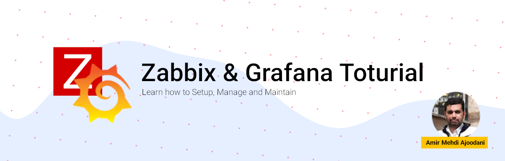

# Zabbix and Grafana course resources

## What you can find here?

Zabbix & Grafana tutorial is a free online course that helps you to learn how to install, manage and maintain these two amazing tools together.
You can find resources related to our amazing **Zabbix & Grafana** course.

## I found a problem. what should I do?

Oh, that's easy. Just try to pick one of the methods to contact me:

- Create one issue and describe the problem.
- Send me a message on Telegram: [Amir Mehdi Ajoodani](https://t.me/amirajoodani).
- Find me on LinkedIn using this link: [Amir Mahdi Ajoodani](https://www.linkedin.com/in/amir-mahdi-ajoodani-263090124)

## Where I can Watch and Follow this course?

Good question! , On youtube of course. Every DevopsHobbies course is published on the Youtube platform and you can use the below links to watch this course and other free and amazing courses.

- [Course PlayList on Youtube](https://youtube.com/playlist?list=PLYrn63eEqAzaEkGmYAn6StHk4rqVEjd_g)
- [DevopsHobbies youtube channel](https://youtube.com/@devopshobbies)
